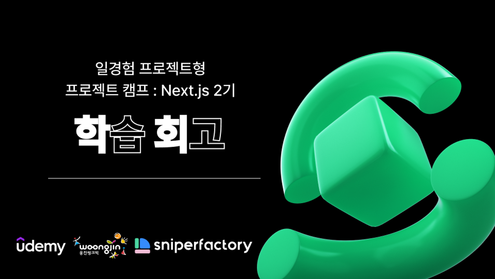

# [유데미x스나이퍼팩토리] 프로젝트 캠프 : Next.js 2기 - 1주차 회고: JavaScript & TypeScript



## HTML 파싱과 `script` 태그 처리

- html은 파서는 `script`태그를 만나면 파싱을 중단하고 해당 스크립트 파일을 가져와서(`fetching`) 파싱하고 실행한다.
- 이로인해 js파일에 HTML Element를 조작하려고 할 때, 필요한 HTML Element가 파싱되지않아 에러가 발생할 수 있다.
- 이때 아래 속성을 통해 해결할 수 있다.

### `async` 속성

- 스크립트파일을 병렬로 fetching하고 다운로드 완료 후 즉시 실행한다.
- 스크립트파일이 여러개인 독립적으로 로드되고 실행되므로 순서가 보장되지않는다.

### `defer` 속성

- async와 동일하게 병렬로 fetching하지만 문서 파싱완료 후 스크립트를 실행하여 정의된 순서대로 실행한다.

---

<details>
<summary>과제(Day02)</summary>

```js
// Q1
for (let i = 1; i < 10; i++) {
  console.log(i);
}

// Q2
let numArr = [10, -10, 20, -30, 40];

let sum = 0;
for (let num of numArr) {
  if (num >= 0) {
    sum += num;
  }
}
console.log(sum);

// Q3
for (let i = 0; i < 16; i++) {
  if (i % 2 === 0) {
    console.log(i, '짝수');
  } else {
    console.log(i, '홀수');
  }
}

// Q4
for (let i = 100; i < 999; i++) {
  const str = i.toString();
  if (i === str[0] ** 3 + str[1] ** 3 + str[2] ** 3) {
    console.log(i);
  }
}

// gugudan
const gugudan = function (n) {
  for (let i = 1; i < 10; i++) {
    console.log(`${n} * ${i} = ${n * i}`);
  }
};
```

</details>

<details>
<summary>과제(Day03)</summary>

```js
const i = 'aaabbbccc';
const i2 = 'aabbaa';
const i3 = 'abbbffd';
// 1
const summary2 = (str) => {
  let printResult = '';
  let count = 1;
  for (let i = 0; str.length > i; i++) {
    if (str[i] === str[i + 1]) {
      count += 1;
    } else {
      printResult += str[i] + count;
      count = 1;
    }
  }
  console.log(printResult);
};
summary2(i);
summary2(i2);
summary2(i3);
// 2-1
function gugudan3() {
  for (let i = 1; i < 10; i++) {
    console.log(`${3} * ${i} = ${3 * i}`);
  }
}
gugudan3();
// 2-2
const gugudan4 = function () {
  for (let i = 1; i < 10; i++) {
    console.log(`${4} * ${i} = ${4 * i}`);
  }
};
gugudan4();
// 2-3
const gugudan5 = function gugudan5() {
  for (let i = 1; i < 10; i++) {
    console.log(`${5} * ${i} = ${5 * i}`);
  }
};
gugudan5();
```

</details>

<details>
<summary>과제(Day04)</summary>

```js
const students = [
  { name: 'Alice', age: 21, gender: 'male', height: 170 },
  { name: 'Bob', age: 19, gender: 'male', height: 165 },
  { name: 'Charlie', age: 20, gender: 'male', height: 175 },
  { name: 'David', age: 22, gender: 'male', height: 180 },
  { name: 'Eve', age: 17, gender: 'female', height: 160 },
  { name: 'Frank', age: 18, gender: 'male', height: 175 },
  { name: 'Grace', age: 21, gender: 'female', height: 165 },
  { name: 'Henry', age: 19, gender: 'male', height: 170 },
  { name: 'Ivy', age: 20, gender: 'female', height: 155 },
  { name: 'Jack', age: 22, gender: 'male', height: 185 },
];

// 1. 키가 185인 학생 찾기
{
  const q1 = students.find((el) => el.height === 185);
  console.log(q1);
}

//2. 나이가 20살 이상인 학생들 찾기
{
  const q2 = students.filter((el) => el.age >= 20);
  console.log(q2);
}

//3. 키가 165 이하인 학생들이 있는지 찾아서 true, false로 반환하기
console.log('3', '-'.repeat(45));
{
  const q3 = students.some((el) => el.height <= 165);
  console.log(q3);
  // const q3 = students.map((el) => el.height <= 165);
  // console.log(q3);
}

//4. 학생들이 모두 10살 이상인지 확인해서 true, false 반환하기
{
  const q4 = students.every((el) => el.age >= 10);
  console.log(q4);
}

//5. 학생들의 평균 연령 구하기
{
  const q5 = students.reduce((acc, curr) => acc + +curr.age, 0);
  console.log(q5 / students.length);
}

//6. 남학생들의 평균 연령 구하기
{
  const q6 = students.filter((el) => el.gender === 'male');
  const q6_1 = q6.reduce((acc, curr) => acc + +curr.age, 0);
  console.log(q6_1 / q6.length);
}

console.log('-'.repeat(45));

//7. 야학생들만 따로 추출해서 새로운 배열 만들기
{
  const q7 = students.filter((el) => el.gender === 'female');
  console.log(q7);
}

console.log('-'.repeat(45));

//8. 여학생들 중 나이가 가장 어린 학생 찾기
{
  const q8 = students
    .filter((el) => el.gender === 'female')
    .sort((a, b) => b.age - a.age)
    .pop();
  console.log(q8);
}

// 연습문제1
function reverse_to_number(number) {
  const a = number.toString().split('').reverse().join('');
  return +a;
}

let a = reverse_to_number(32125);
console.log(a);

let b = reverse_to_number(13251);
console.log(b);

// 연습문제2
function findLongStr(str) {
  const strSplit = str.split(' ');
  const strLength = strSplit.map((el) => el.length);
  const max = strLength.indexOf(Math.max(...strLength));
  return strSplit[max];
}

let result = findLongStr('we are the champion');
console.log(result);

let result2 = findLongStr('i`m fine thank you, and you?');
console.log(result2);
```

</details>

---

### Review

- 그동안 공부하며 동작원리등에 대해 깊게 생각하지 않고 당연시해왔던 부분들에 대해 쉽고 자세하게 설명해주셨다.

- typeScript 같은 경우 이론적으로만 알고 실제로 사용해본적은 없었는데 이들을 정의할때 I, T와 같은 대문자를 관행적으로 붙여 사용하는 점 등을 알 수 있었다.

---

###### 본 후기는 [유데미x스나이퍼팩토리] 프로젝트 캠프: Next.js 2기 과정(B-log) 리뷰로 작성 되었습니다.

###### #유데미 #udemy #웅진씽크빅 #스나이퍼팩토리 #인사이드아웃 #미래내일일경험 #프로젝트캠프 #부트캠프 #Next.js #프론트엔드개발자양성과정 #개발자교육과정
